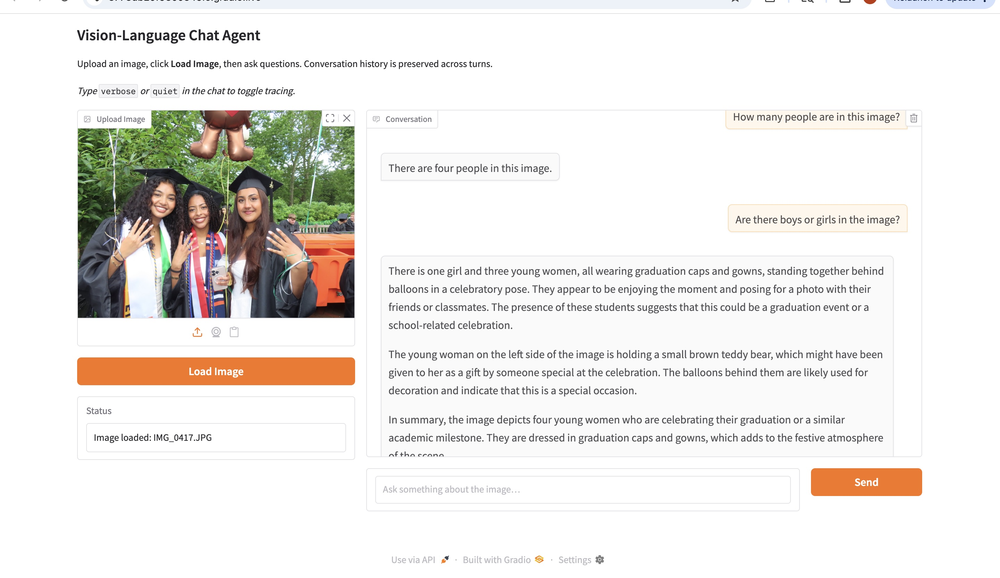

# Topic 6: Vision-Language Models (VLM)

Programs built using [Ollama](https://ollama.com) and the [LLaVA](https://llava-vl.github.io) open vision-language model. All exercises run on Google Colab (T4 GPU), a GPU-equipped PC, or a MacBook.

---

## Table of Contents

| File | Exercise | Description |
|---|---|---|
| [`langgraph_vision_chat.py`](#langraph_vision_chatpy) | Exercise 1 | Multi-turn vision-language chat agent with LangGraph + Gradio UI |
| [`video_surveillance.py`](#video_surveillancepy) | Exercise 2 | Video surveillance agent — detects when a person enters/exits a scene |

---

## `langgraph_vision_chat.py`

**Exercise 1 — Vision-Language LangGraph Chat Agent**

A multi-turn chat agent that lets you upload an image and ask questions about it across multiple conversational turns. Built with LangGraph for state management and Gradio for the web UI.

### How it works

1. **Upload an image** in the Gradio UI and click Load Image. This stores the image path in LangGraph state via an initial `graph.invoke()`.
2. **Ask a question** in the chat box. Each submit triggers one `graph.invoke()` call.
3. **LangGraph routes** the input through two nodes:
   - `ingest_user_turn` — validates input, handles special commands (`verbose`/`quiet`/`quit`), appends a `HumanMessage` to history
   - `call_llava` — builds the Ollama message list from rolling history, resizes the image, calls LLaVA, appends the `AIMessage` reply
4. **SqliteSaver** checkpoints the full conversation state to a SQLite file between HTTP calls so history survives across turns.
5. The **Gradio UI** is the outer loop — the graph is single-turn per invoke (no blocking `input()` node needed).

### Key design decisions

| Decision | Why |
|---|---|
| Image path in state, not base64 | Keeps the SQLite checkpoint DB small |
| Image attached to latest user turn only | Ollama calls are stateless — no KV cache between calls |
| Rolling context window (last 6 messages) | Prevents the prompt from growing unboundedly |
| In-memory resize cache | Avoids re-encoding the image on every turn |
| Single-turn graph topology | Gradio is the outer loop; cleaner separation of concerns |

### How to run (Google Colab)

```python
# Cell 1 — Install
!pip -q install ollama gradio pillow langgraph langchain-core
!curl -fsSL https://ollama.com/install.sh | sh

# Cell 2 — Start Ollama with GPU support
import subprocess, os, time

env = {
    **os.environ,
    "OLLAMA_NUM_GPU": "999",
    "CUDA_VISIBLE_DEVICES": "0",
    "LD_LIBRARY_PATH": (
        "/usr/local/cuda-12.8/compat:"
        "/usr/lib64-nvidia:"
        "/usr/local/cuda/lib64:"
        "/usr/local/cuda/targets/x86_64-linux/lib:"
        + os.environ.get("LD_LIBRARY_PATH", "")
    ),
}
log = open("/tmp/ollama_server.log", "w")
subprocess.Popen(["ollama", "serve"], env=env, stdout=log, stderr=log)
time.sleep(5)

# Cell 3 — Pull model
!ollama pull llava:7b-v1.6-mistral-q4_0

# Cell 4 — Run
%run langgraph_vision_chat.py
```

Open the `gradio.live` URL that appears, upload an image, and start chatting.

### Special chat commands

| Command | Effect |
|---|---|
| `verbose` | Print debug traces (node inputs, message counts, reply preview) to Colab output |
| `quiet` | Suppress debug traces |
| `quit` | Exit (CLI mode only) |

### Constants you may want to tune

```python
MODEL            = "llava:7b-v1.6-mistral-q4_0"
MAX_SIDE         = 336    # resize longest image edge to this many pixels
CONTEXT_MESSAGES = 6      # rolling window: last N messages sent to LLaVA
```

---

## `video_surveillance.py`

**Exercise 2 — Video Surveillance Agent**

Processes a pre-recorded video to detect when a person enters and exits the scene. Since LLaVA cannot process video directly, the video is split into frames and each frame is sent to LLaVA individually.

### How it works

1. **`extract_frames()`** — Opens the video with OpenCV, samples one frame every 2 seconds, resizes each frame to 336px, saves them as JPEGs in a `frames/` directory, and returns a list of `(timestamp, filepath)` pairs.
2. **`detect_person()`** — Sends a single frame to LLaVA with the prompt *"Is there a person visible in this scene? Reply with only one word: YES or NO."* Returns `True` or `False`.
3. **`run_surveillance()`** — Iterates over all frames, calls `detect_person()` on each, and watches for **state transitions**:
   - `NO → YES` : person entered — record timestamp
   - `YES → NO` : person exited — record timestamp
   
   Prints a live frame-by-frame table as it runs.
4. **`print_report()`** — Prints a final timestamped summary of all entry/exit events and time-in-scene durations.

### Sample output

```
Frame    Time     Person?    Event
─────────────────────────────────────────────
1        00:00    NO         
2        00:02    NO         
3        00:04    YES        ⬅️  ENTERED
...
12       00:22    NO         ➡️  EXITED

══════════════════════════════════════════════
  SURVEILLANCE REPORT
══════════════════════════════════════════════
  00:04  —  Person ENTERED scene
  00:22  —  Person EXITED scene

Time in scene:
  Visit 1: 00:04 → 00:22  (18s)
```

### How to run (Google Colab)

```python
# Install OpenCV (lightweight version — contrib not needed)
!pip -q install opencv-python

# Upload your video to the script directory, then:
%run video_surveillance.py
```

Set `VIDEO_PATH` in the constants to the full path of your video file:

```python
VIDEO_PATH = "/content/cs6501workshop/Topic6VLM/video.mp4"
```

### Constants you may want to tune

```python
MODEL          = "llava:7b-v1.6-mistral-q4_0"
FRAME_INTERVAL = 2      # seconds between sampled frames
MAX_SIDE       = 336    # resize frames before sending to LLaVA
```

### Runtime estimate

A 2-minute video produces ~60 frames. On a Colab T4 GPU with `llava:7b-v1.6-mistral-q4_0`, each frame takes ~5-10 seconds to process — expect **5-10 minutes** total. The first frame is slower (~15-20s) while Ollama loads the model into VRAM.

---

## Setup — Google Colab (both exercises)

The T4 GPU in Colab requires explicit CUDA library paths for Ollama to use the GPU. Use this setup sequence at the start of every new runtime:

```python
# 1. Install packages
!pip -q install ollama gradio pillow langgraph langchain-core opencv-python
!curl -fsSL https://ollama.com/install.sh | sh

# 2. Start Ollama with GPU support
import subprocess, os, time
env = {
    **os.environ,
    "OLLAMA_NUM_GPU": "999",
    "CUDA_VISIBLE_DEVICES": "0",
    "LD_LIBRARY_PATH": (
        "/usr/local/cuda-12.8/compat:"
        "/usr/lib64-nvidia:"
        "/usr/local/cuda/lib64:"
        "/usr/local/cuda/targets/x86_64-linux/lib:"
        + os.environ.get("LD_LIBRARY_PATH", "")
    ),
}
log = open("/tmp/ollama_server.log", "w")
subprocess.Popen(["ollama", "serve"], env=env, stdout=log, stderr=log)
time.sleep(5)
!cat /tmp/ollama_server.log | grep -i "library"   # should show library=CUDA

# 3. Pull model
!ollama pull llava:7b-v1.6-mistral-q4_0
```

---

## Model Selection — Why `llava:7b-v1.6-mistral-q4_0`

The assignment suggests `ollama pull llava` which defaults to `llava:7b` (LLaMA-based, ~4.7 GB). On a Colab T4 this consistently crashed with:

```
ollama._types.ResponseError: model runner has unexpectedly stopped,
this may be due to resource limitations or an internal error
```

The root cause was a CUDA version mismatch — Colab's driver reports CUDA 13.0 but the toolkit is 12.8, and Ollama's bundled runtime couldn't find `libcuda.so` in the standard paths, causing it to silently fall back to CPU and then OOM during inference.

Two fixes were needed:

**1. Use the Mistral-based quantized variant instead of the default:**

| Model | Base LLM | Quantization | Size | T4 result |
|---|---|---|---|---|
| `llava:7b` | LLaMA | Q4 | 4.7 GB | ❌ crashes |
| `llava:7b-v1.6-mistral-q4_0` | Mistral | Q4_0 | 4.7 GB | ✅ works |

Interestingly both models share the same model ID (`8dd30f6b0cb1`) — they are the same weights with different tags. The fix was not the model itself but fixing the GPU setup so Ollama actually used the T4 instead of crashing on CPU.

**2. Explicitly set CUDA library paths when starting Ollama:**

Colab installs `libcuda.so` at `/usr/lib64-nvidia/` and the CUDA 12.8 compat layer at `/usr/local/cuda-12.8/compat/` — neither of which is in Ollama's default search path. Setting `LD_LIBRARY_PATH` to include both paths before starting `ollama serve` resolved the crash. Confirmed working when the server log shows:

```
msg="inference compute" library=CUDA compute=7.5 name=CUDA0
description="Tesla T4" total="15.0 GiB" available="14.6 GiB"
```

---

## What the Output Tells Us

### Exercise 1 — Chat Agent

The screenshot below shows the Gradio UI with a graduation photo loaded and two conversational turns completed.



**Turn 1** — "How many people are in this image?"
LLaVA replies concisely: *"There are four people in this image."* — WRONG! 

**Turn 2** — "Are there boys or girls in the image?"
LLaVA's reply builds directly on Turn 1: *"There is one girl and three young women, all wearing graduation caps and gowns..."* It references the same four people identified in the previous turn rather than re-examining the image from scratch. This confirms the rolling context window is working — the full `HumanMessage`/`AIMessage` history is being passed to LLaVA on each call.

The Turn 2 response also illustrates a characteristic LLaVA behaviour: it elaborates well beyond what was asked, describing the teddy bear one of the graduates is holding, the balloons in the background, and offering a full narrative summary of the scene. This is typical of a 7B instruction-tuned model — it has learned to be descriptive rather than terse. It is harmless in a chat context but would break the surveillance agent if not controlled, which is why that prompt explicitly says *"Reply with only one word: YES or NO"*.

### Exercise 2 — Surveillance Agent

The frame-by-frame table shows the raw per-frame classification and the final report shows only the state transitions that matter:

```
  00:04  —  Person ENTERED scene
  00:22  —  Person EXITED scene
  Visit 1: 00:04 → 00:22  (18s)
```

This tells us the scene was empty for the first two seconds, a person appeared at 4 seconds and remained for 18 seconds before the scene became empty again. The state-transition approach filters out the noise of repeated YES/YES/YES frames and surfaces only the meaningful events — entry and exit — which is what a real surveillance system would log.

A limitation of this approach is the **2-second sampling resolution**: if a person enters and exits within a single 2-second interval they will be missed entirely. Reducing `FRAME_INTERVAL` improves detection resolution at the cost of more LLaVA calls and longer runtime.

---

## Resources

- [Gradio Quickstart](https://www.gradio.app/guides/quickstart)
- [LangGraph Documentation](https://langchain-ai.github.io/langgraph/)
- [Ollama Model Library](https://ollama.com/library)
- [LLaVA Project Page](https://llava-vl.github.io)
